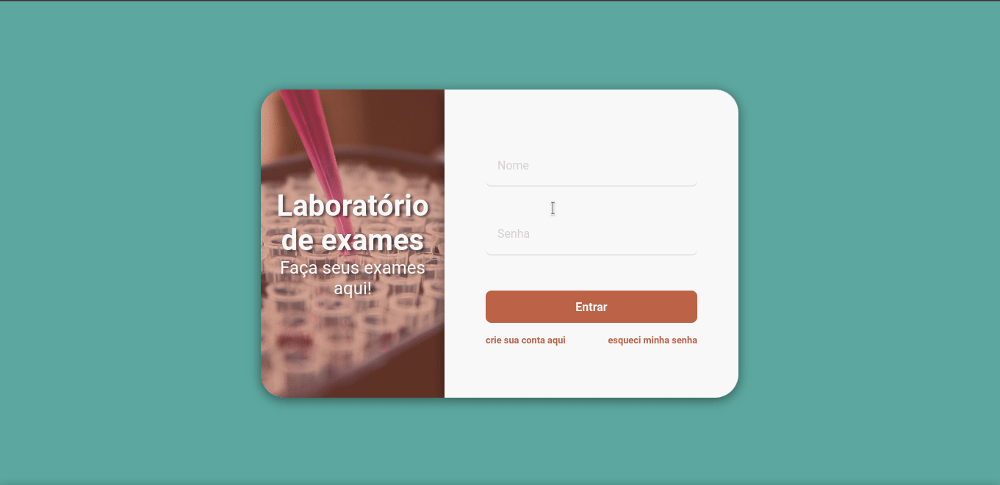

# 🚧 Projeto de estudo

Projeto criado para o estudo de _HTML5_ & _CSS3_

## 🚀 Tecnologia usadas

- [x] 💪 [_html5_](https://developer.mozilla.org/pt-BR/docs/Web/HTML)
- [x] 💪 [_css3_](https://developer.mozilla.org/pt-BR/docs/Web/CSS)
- [x] 💪 [_flexbox_](https://developer.mozilla.org/pt-BR/docs/Learn/CSS/CSS_layout/Flexbox)
- [x] 💪 [_viewport_](https://developer.mozilla.org/en-US/docs/Web/CSS/Viewport_concepts)

